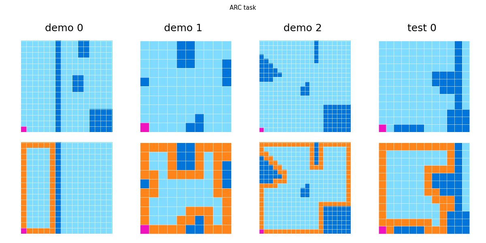

# Giotto Arc Data
Official repository to access the Giotto Arc Dataset. The dataset is hosted at Zenodo ([here](https://zenodo.org/records/18508333)) and is publicly available via [this licence](LICENSE).

## Installation
```shell
git clone git@github.com:giotto-ai/giotto-arc-agi-data.git
cd giotto-arc-agi-data
python3.11 -m venv venv
source venv/bin/activate
pip install .
```

## Dataset
The dataset contains 4 different parquet files, depending on how we generated the data:
- `seeds_original`: the original ARC-AGI 1 + ARC-AGI 2;
- `seeds_additional`: ARC-AGI tasks generated manually;
- `automata`: used cellular automata applied at the pixel level to transform the tasks via a consistent transformation that is not breaking the rule;
- `dsl_random`: apply random transformations to the tasks (e.g. random color permutations, padding, adding a metagrid);
- `dsl_deterministic`: apply all geometric transformations to the input or the output grids;
- `rearc`: coded functions for procedurally generate tasks following a griven rule. Inspiration taken from [this repo](https://github.com/michaelhodel/re-arc).

See the table below for more info on the shards's sizes and content.

| name              | no. of tasks | size [MB] |
| ----------------- | ------------ | --------- |
| seeds_original    | 1141         | <1        |
| seeds_additional  | 4664         | 5.0       |
| automata          | 708437       | 655.0     |
| dsl_random        | 141376       | 334.3     |
| dsl_deterministic | 150510       | 129.1     |
| rearc             | 182372       | 115.6     |


## Usage
See [this notebook](notebooks/example_usage.ipynb) to see how to use the dataset.

### Load dataset as a stream (recommended)
We recommend to load the dataset an `Iterator`, because loading it fully can take quite some time and a lot of RAM. 

```python
data_iterator = load_dataset(stream=True)

# get the first pair (task_id, task)
task_id, task = next(iter(data_iterator))

# plot the task
plot_task(task=task)

### Loop through the entire dataset:
count = 0
for task_id, task in data_iterator:
    if count > 100:
        break
    count += 1
print(f'Total tasks: {count}')
```

Expected output (the downloading info are supposed to show up only at the first execution of the cell):
```
Downloading seeds_additional.parquet
100%|██████████| 5.05M/5.05M [00:00<00:00, 28.5MB/s]
Downloading dsl_random.parquet
100%|██████████| 116M/116M [00:01<00:00, 85.8MB/s] 
Downloading rearc.parquet
100%|██████████| 334M/334M [00:04<00:00, 78.3MB/s] 
Downloading automata.parquet
100%|██████████| 655M/655M [00:08<00:00, 83.4MB/s] 
Downloading dsl_deterministic.parquet
100%|██████████| 129M/129M [00:01<00:00, 88.9MB/s] 
Downloading seeds_original.parquet
100%|██████████| 873k/873k [00:00<00:00, 6.05MB/s]
Download complete.
Total tasks: 101
```



### Loading the full dataset
```python
data = load_dataset(path="../test/dataset_sample")
print(f'Total tasks: {count}')
```

